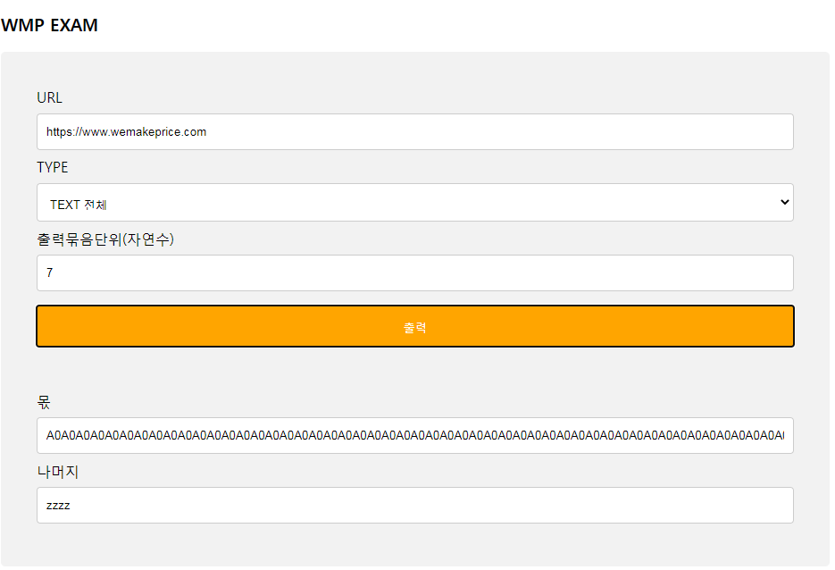

## WMP EXAM

## Contents
* [Specifications](#chapter-1)
* [Requirement](#chapter-2)
* [How to run](#chapter-3)
* [How to Test](#chapter-4)


### <a name="chapter-1"></a>Specifications 
````
 OpenJDK11
 Spring Boot 2.3.0.RELEASE
 Thymeleaf 
````

### <a name="chapter-2"></a>Requirement 
````
유효한 URL을 입력받아 HTML을 획득하여 아래 요구사항을 만족하는 서비스를 구현
- 모든 문자 입력 가능
- 영어 숫자만 출력 
- 숫자 오름 차순으로 정렬
- 영어는 알파벳 순으로 정렬 단 대문자가 우선순위가 높음
- 출력은 영어, 숫자 순으로 교차 출력
- 숫자를 입력 받아 묶음, 나머지 출력
````

### <a name="chapter-3"></a>How to Run
```
1. build
./gradlew build

2. run
./gradlew bootrun

3. test 
./gradlew test
```

### <a name="chapter-4"></a>How to Test
1. Spring Boot Application을 실행 합니다. 

2. http://localhost:8080 페이지에 접속 합니다.

3. 유효한 url, HTML 태크 제거 여부, 출력 묶음 단위를 입력하고 출력 버튼을 누릅니다.

4. 몫과, 나머지를 확인 합니다.

 

